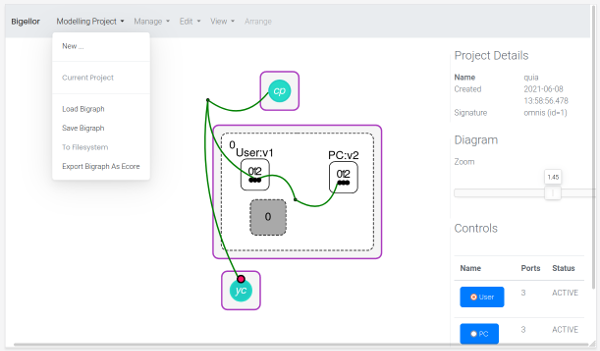
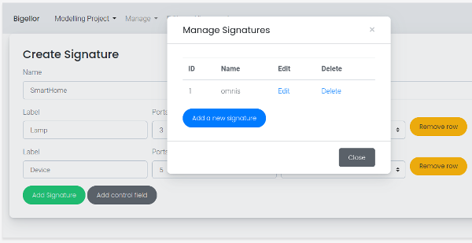

> Latest Version: **2.1.0**

- ✅ For Users: See [Docker](#docker-container) for how to install and run the application as a container.
- 🧑‍💻 For Developers: See [Building from Source](#building-from-source) if you want to build and run Bigellor locally.

---- 

# Bigellor

**Bigellor** is a web-based modelling tool to graphically create and visualize bigraphs.

The underlying web development framework of **Bigellor** is a combination of [Spring framework](https://spring.io) and [Thymeleaf](https://www.thymeleaf.org/),  
and [Cytoscape.js](https://js.cytoscape.org/) for the visualization of bigraphs in the browser.

## Screenshots





## Getting Started


### Docker Container

Build the image:

```shell
$ docker build -t bigellor-app .
```

Run the container:

```shell
$ docker run -p 8080:8080 bigellor-app
```

Then, just open the web browser and navigate to 
- [`http://localhost:8080`](http://localhost:8080).

**Optional: Change App Port**

If you want the app to run on a different port (e.g. 9090), you need execute:

```shell
$ docker run -p 9090:9090 \
-e "SPRING_APPLICATION_JSON={\"server.port\":9090}" \
bigellor-app
```

### Building from Source

**Requirements**

- Java >= 17
- Maven >= 3.8.3

**Building the App**

The following command must be executed from the root directory of this project:
```shell
$ mvn clean package -DskipTests
```

After the command successfully finishes, the executable application can be found in the directory `dist/`
from the root of this project.

### Starting Bigellor

> **Note:** Ensure that there is read/write permission on the directory, where **Bigellor** is started.

After the build process is successfully finished, you can start **Bigellor**.

Therefore, execute the following commands:
```shell
$ cd ./dist/
$ java -jar bigellor-starter-2.1.0-exec.jar
```

Then, just open the web browser and navigate to [`http://localhost:8080`](http://localhost:8080).

The correct server name and port will be displayed in the console if defaults were changed.

#### Arguments to Configure

Properties can be configured when starting **Bigellor** in the following way:
```shell
$ java -jar bigellor-starter-VERSION-exec.jar --PROPERTY=VALUE --PROPERTY2=VALUE2 ...
```

| Property                          | Description                                                                                                                                               |
|-----------------------------------|-----------------------------------------------------------------------------------------------------------------------------------------------------------|
| `bigellor.gen-test-data`          | (Optional) `true` or `false`. If `true` then a demo signature will be provided in `data/signatures/` and available in the IDE.                            |
| `bigellor.model.storage.location` | (Optional) A relative folder path. It denotes the storage directory for all user-uploaded model files in Bigellor.                                        |
| `server.port`                     | (Optional) A port number. This determines the server port of Bigellor. Default is `8080`.                                                                 |
| `bigellor.cdo.config`             | (Optional) A relative folder path to the Eclipse CDO database configuration file (usually located at `config/cdo-server.xml`). A default one is provided. |

### Database Configuration

[Eclipse CDO](https://projects.eclipse.org/projects/modeling.emf.cdo) is used as database for all bigraphical model files.
(Note that the model files are currently also persisted on the filesystem.)
The server boots in the background when Bigellor is started; the database uses the folder `data/` relative to the application for persistence.
To access Eclipse CDO in Bigellor conveniently the Spring-way (via repositories), the framework [Spring Data CDO](https://github.com/bigraph-toolkit-suite/spring-data-cdo) is used.

An example of the default database configuration properties can be found here: `src/main/resources/config/cdo-server.xml`.
When Bigellor is build from source, the application can be found in the `dist/` folder from the root of this project.
Included is also the `config/cdo-server.xml`, which can be configured afterward.

Use Eclipse CDO Explorer to view and modify the bigraphs directly in the database.
You can download the CDO Explorer via the [Eclipse Installer](https://www.eclipse.org/downloads/packages/installer).
Use Eclipse Version 2022-12 (4.26.0), which supports CDO protocol version **48**.

## Build Problems and Solutions

In case you are getting an error while building the project similar to
```
Fatal error compiling: error: invalid target release: 17
```
check the JDK for Maven with `mvn --version`:
```shell
$ mvn --version
Apache Maven 3.9.5
Maven home: /opt/maven
Java version: 11.0.20.1
```

In this example, Maven version 3.9.5 uses the JDK 11.
However, JDK 17 is required for this project (see [Requirements](#Getting-Started)).
It helps to correct the `JAVA_HOME` environment variable.

## Acknowledgement

Thanks to Simon Tobies for his contributions to the visualization and modeling backend of Bigellor.

## License

**Bigellor** is Open Source software released under the Apache 2.0 license.

```text
   Copyright 2023-present Bigraph Toolkit Developers

   Licensed under the Apache License, Version 2.0 (the "License");
   you may not use this file except in compliance with the License.
   You may obtain a copy of the License at

 https://www.apache.org/licenses/LICENSE-2.0

   Unless required by applicable law or agreed to in writing, software
   distributed under the License is distributed on an "AS IS" BASIS,
   WITHOUT WARRANTIES OR CONDITIONS OF ANY KIND, either express or implied.
   See the License for the specific language governing permissions and
   limitations under the License.
```
